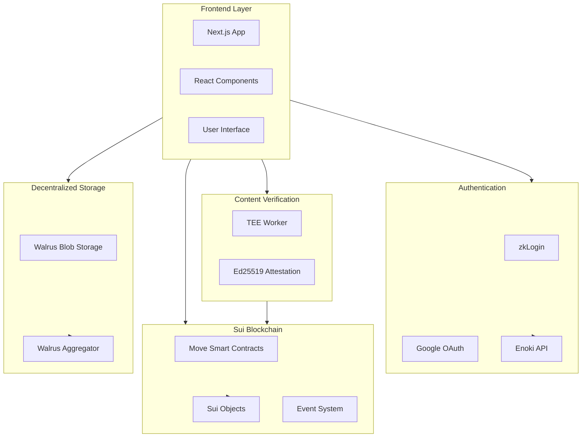
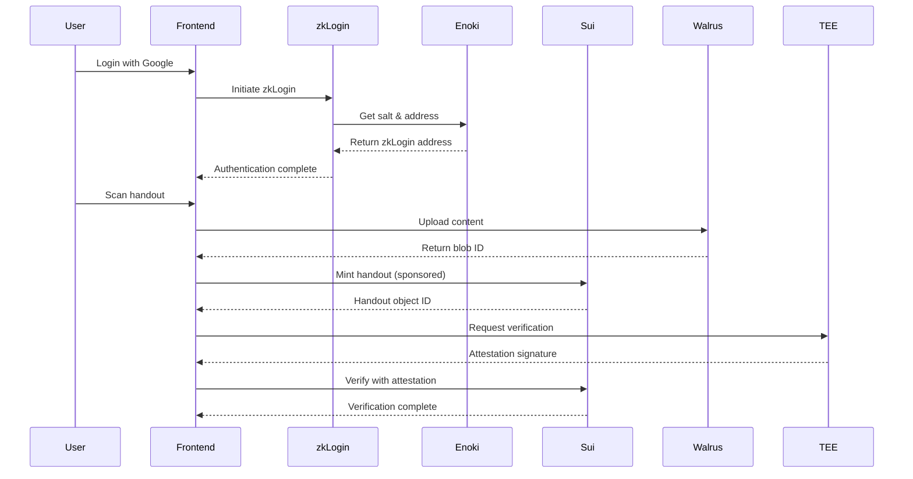

# Suiecho - Decentralized Reader for the Visually Impaired

> **Connecting Voices, Empowering Minds** - A blockchain-powered accessibility platform that transforms physical handouts into accessible audio content for visually impaired students.

## Table of Contents

- [Introduction](#introduction)
- [Architecture Overview](#architecture-overview)
- [Sui Technology Stack](#sui-technology-stack)
- [Key Features](#key-features)
- [Project Structure](#project-structure)
- [Setup & Installation](#setup--installation)
- [Usage Guide](#usage-guide)
- [Development](#development)
- [Security & Privacy](#security--privacy)
- [Future Roadmap](#future-roadmap)

## Introduction

### Problem Statement

Visually impaired students face significant barriers accessing physical course materials. Traditional solutions are expensive, time-consuming, and often require manual intervention. Suiecho addresses this by leveraging blockchain technology to create a decentralized, accessible, and incentivized platform for content conversion.

### Solution

Suiecho enables:
- **Instant Access**: Scan physical handouts and convert them to audio in real-time
- **Decentralized Storage**: Content stored on Walrus (Sui's blob storage) for permanent, censorship-resistant access
- **Verified Content**: TEE-based verification ensures content authenticity
- **Incentivized Ecosystem**: Students earn rewards for verified handouts, course reps can broadcast announcements
- **Zero Gas Fees**: Sponsored transactions via Enoki make the platform accessible to all users

### Target Users

- **Students/Readers**: Visually impaired students who need accessible course materials
- **Course Representatives**: Verified reps who broadcast announcements and verify content
- **Lecturers**: Content creators who provide code words for rep verification
- **Administrators**: Platform managers who approve course rep applications

## Architecture Overview

### System Architecture



### Component Interaction



## Sui Technology Stack

### 1. Sui Move

**What it is**: Sui Move is a safe, resource-oriented programming language designed for writing smart contracts on the Sui blockchain. It provides strong type safety, ownership semantics, and built-in security features.

**How Suiecho uses it**: 
- Core business logic in `sui-echo-move/sources/echo.move`
- Defines data structures: `Handout`, `CourseRepBroadcast`, `CourseRepCap`, `AlumniAjo`
- Implements verification logic, reward distribution, and access control
- Uses Sui's object-centric model for ownership and transfer

**Why it's better**:
- **Type Safety**: Prevents common bugs through compile-time checks
- **Ownership Model**: Clear ownership semantics prevent double-spending and unauthorized access
- **Resource Safety**: Move's linear type system ensures resources are never duplicated or lost
- **Gas Efficiency**: Optimized for Sui's parallel execution, reducing transaction costs
- **Upgradeability**: Smart contract modules can be upgraded while maintaining data integrity

**Implementation**: `sui-echo-move/sources/echo.move`

**Key Features Used**:
- Struct definitions with `key` and `store` abilities
- Public functions for on-chain operations
- Event emission for off-chain tracking
- Dynamic fields for flexible data storage
- Table data structure for efficient lookups

### 2. zkLogin

**What it is**: zkLogin is Sui's passwordless authentication system that uses zero-knowledge proofs to authenticate users via OAuth providers (Google, Facebook, etc.) without requiring traditional wallets or seed phrases.

**How Suiecho uses it**:
- Users authenticate with Google OAuth
- Zero-knowledge proofs verify identity without exposing personal data
- Generates deterministic Sui addresses from OAuth credentials
- Session management via JWT tokens stored in browser sessionStorage

**Why it's better**:
- **No Wallet Required**: Users don't need to install browser extensions or manage private keys
- **Privacy-Preserving**: Zero-knowledge proofs verify identity without revealing personal information
- **User-Friendly**: Familiar OAuth login flow (Google Sign-In)
- **Secure**: Cryptographic proofs ensure authenticity without storing sensitive data
- **Accessible**: Lowers barrier to entry for non-crypto-native users

**Implementation**: `src/utils/zklogin-proof.ts`

**Flow**:
1. User clicks "Continue with Google"
2. Redirects to Google OAuth
3. Google returns JWT token
4. Frontend generates zkLogin proof
5. Enoki API provides salt for address generation
6. User receives zkLogin address (deterministic from JWT + salt)

### 3. Enoki

**What it is**: Enoki is Mysten Labs' wallet infrastructure service that provides managed wallet solutions, sponsored transactions, and salt management for zkLogin.

**How Suiecho uses it**:
- Salt management for zkLogin address generation
- Sponsored transaction execution (gasless transactions)
- ZK proof generation via Enoki API
- Wallet infrastructure without user-managed keys

**Why it's better**:
- **Gasless Transactions**: Users don't need SUI for gas fees, improving accessibility
- **Managed Infrastructure**: No need to run proof generation servers
- **Production-Ready**: Enterprise-grade reliability and security
- **Simplified Development**: API handles complex zkLogin operations
- **Cost-Effective**: Reduces operational overhead for transaction sponsorship

**Implementation**: 
- `src/utils/zklogin-proof.ts` (salt management)
- `src/app/api/sponsor/route.ts` (sponsored transactions)

### 4. dApp Kit

**What it is**: dApp Kit is a React component library and hooks collection for building Sui dApps. It provides wallet connection, transaction signing, and state management.

**How Suiecho uses it**:
- `ConnectButton` component for wallet connection
- `useCurrentAccount` hook for account state
- `useSignAndExecuteTransaction` for transaction execution
- Provider setup in `src/app/providers.tsx`

**Why it's better**:
- **React Integration**: Seamless integration with React applications
- **Type Safety**: Full TypeScript support
- **State Management**: Automatic wallet state synchronization
- **UI Components**: Pre-built, accessible components
- **Flexibility**: Works with both zkLogin and traditional wallets

**Implementation**: `src/app/providers.tsx`, used throughout the app

### 5. Sui SDK

**What it is**: The Sui SDK (@mysten/sui) is the core JavaScript/TypeScript library for interacting with the Sui blockchain. It provides client APIs, transaction building, and type definitions.

**How Suiecho uses it**:
- `SuiClient` for RPC calls (querying objects, executing transactions)
- `Transaction` builder for constructing Move calls
- Type definitions for Sui objects and events
- Object querying and filtering

**Why it's better**:
- **Comprehensive API**: Complete coverage of Sui blockchain operations
- **Type Safety**: Full TypeScript definitions
- **Performance**: Optimized for Sui's object-centric model
- **Flexibility**: Supports both JSON-RPC and GraphQL queries
- **Developer Experience**: Well-documented with examples

**Implementation**: Used throughout the app, primarily in:
- `src/utils/zklogin-proof.ts`
- `src/app/dashboard/page.tsx`
- `src/app/dashboard/broadcasts/page.tsx`

### 6. Walrus

**What it is**: Walrus is Sui's decentralized blob storage system that provides permanent, censorship-resistant storage for large files (images, audio, documents) off-chain while maintaining on-chain references.

**How Suiecho uses it**:
- Stores scanned handout text content
- Stores audio recordings from course reps
- Returns blob IDs that are stored on-chain in Sui objects
- Aggregator API for content retrieval

**Why it's better**:
- **Decentralized**: Content stored across multiple nodes, resistant to censorship
- **Permanent**: Content persists across epochs (configurable retention)
- **Cost-Effective**: Off-chain storage reduces on-chain gas costs
- **Scalable**: Handles large files efficiently
- **Accessible**: HTTP API for easy integration

**Implementation**: `src/lib/walrus.ts`

**Usage Flow**:
1. Upload content to Walrus Publisher API
2. Receive blob ID
3. Store blob ID in Sui object (Handout or Broadcast)
4. Retrieve content via Walrus Aggregator API

### 7. Sponsored Transactions

**What it is**: Sponsored transactions allow a third party (sponsor) to pay gas fees on behalf of users, enabling gasless user experiences.

**How Suiecho uses it**:
- All zkLogin transactions are sponsored via Enoki
- Backend API endpoint (`/api/sponsor`) handles sponsorship
- Users never need SUI for transactions
- Enoki API key stored server-side for security

**Why it's better**:
- **Zero Friction**: Users don't need to acquire SUI tokens
- **Better UX**: Removes barrier to entry for new users
- **Accessibility**: Critical for educational platforms serving students
- **Scalability**: Enables mass adoption without gas fee concerns
- **Security**: Sponsorship handled server-side with proper authentication

**Implementation**: 
- `src/app/api/sponsor/route.ts` (sponsor endpoint)
- `src/utils/zklogin-proof.ts` (executeSponsoredZkLoginTransaction)

### 8. TEE (Trusted Execution Environment)

**What it is**: TEE is a secure computing environment that provides hardware-level isolation for executing code and verifying content. In Suiecho, it's used to verify handout content authenticity.

**How Suiecho uses it**:
- TEE worker service verifies scanned content
- Generates Ed25519 signatures attesting to content validity
- On-chain verification using `verify_with_attestation` function
- Prevents tampering and ensures content integrity

**Why it's better**:
- **Content Integrity**: Cryptographic proof that content hasn't been modified
- **Trust**: Hardware-level security ensures verification cannot be compromised
- **Automation**: Automated verification without manual review
- **Scalability**: Can verify large volumes of content efficiently
- **Transparency**: Verification signatures are on-chain and auditable

**Implementation**:
- `src/app/api/verify/route.ts` (TEE worker API)
- `src/app/scan/page.tsx` (attestation flow)
- `sui-echo-move/sources/echo.move` (on-chain verification)

**Verification Flow**:
1. User mints handout on-chain
2. Frontend requests TEE verification
3. TEE worker analyzes content and generates signature
4. Frontend submits attestation to on-chain contract
5. Contract verifies Ed25519 signature
6. Handout marked as verified

### 9. Transaction Builder

**What it is**: Sui's Transaction Builder provides a programmatic way to construct Move function calls, object transfers, and complex transactions.

**How Suiecho uses it**:
- Builds transactions for minting handouts
- Constructs broadcast creation transactions
- Creates course rep application transactions
- Handles object references and pure arguments

**Why it's better**:
- **Type Safety**: Compile-time checking of transaction structure
- **Flexibility**: Supports complex multi-step transactions
- **Readability**: Clear, declarative transaction construction
- **Error Prevention**: Catches errors before transaction submission
- **Developer Experience**: Intuitive API for common operations

**Implementation**: Used throughout the app:
- `src/app/scan/page.tsx` (mint_handout)
- `src/app/dashboard/broadcasts/page.tsx` (broadcast)
- `src/app/dashboard/apply/page.tsx` (apply_for_course_rep)

### 10. Object-Centric Model

**What it is**: Sui's object-centric model treats all data as first-class objects with unique IDs, ownership, and transfer capabilities. This differs from account-based models used by other blockchains.

**How Suiecho uses it**:
- Each handout is a unique object owned by the uploader
- Course rep capabilities are transferable objects
- Broadcasts are objects linked to course reps
- Objects can be queried by owner, type, or ID

**Why it's better**:
- **Ownership Clarity**: Clear ownership semantics for each piece of data
- **Parallel Execution**: Objects can be processed in parallel, improving throughput
- **Flexibility**: Objects can be transferred, shared, or frozen
- **Query Efficiency**: Fast lookups by owner or type
- **Composability**: Objects can reference other objects, enabling complex relationships

**Implementation**: All Move structs with `key` ability become objects:
- `Handout` objects
- `CourseRepCap` objects
- `CourseRepBroadcast` objects

## Key Features

### 1. Document Scanning with OCR

- Real-time camera scanning using HTML5 Video API
- OCR text extraction (Tesseract.js integration)
- Live preview of extracted text
- Confidence metrics display
- Text-to-speech preview

**Files**: `src/components/Scanner.tsx`, `src/app/scan/page.tsx`

### 2. Audio Conversion (TTS)

- Web Speech API integration
- Multiple voice/accent selection (prioritizes Nigerian English)
- Adjustable playback speed (1.0x, 1.5x, 2.0x)
- Spotify-style audio player interface
- Offline-capable TTS

**Files**: `src/app/reader/page.tsx`

### 3. Course Rep Broadcasts

- Voice recording for announcements (up to 5 minutes)
- On-chain broadcast creation
- Course code association
- Audio stored on Walrus
- Broadcast history and statistics

**Files**: `src/app/dashboard/broadcasts/page.tsx`, `src/components/VoiceRecorder.tsx`

### 4. Handout Verification

- TEE-based content verification
- On-chain verification status
- Ed25519 signature attestation
- Verification history tracking
- Reward eligibility based on verification

**Files**: `src/app/scan/page.tsx`, `src/app/api/verify/route.ts`

### 5. Reward System

- SUI token rewards for verified handouts
- Course-specific reward pools (Alumni Ajo)
- Claimable rewards interface
- Reward history tracking
- Sponsorship system for funding pools

**Files**: `sui-echo-move/sources/echo.move` (claim_reward function)

### 6. Admin Panel

- Course rep application review
- Approval/rejection workflow
- Handout verification management
- Platform statistics
- User management

**Files**: `src/app/dashboard/admin/page.tsx`

### 7. Role-Based Access Control

- Student/Reader role: Can scan and listen to handouts
- Course Rep role: Can broadcast and verify handouts
- Admin role: Can approve reps and manage platform
- Verified rep status with capability objects

**Files**: `src/components/Sidebar.tsx`, `sui-echo-move/sources/echo.move`

## Project Structure

```
Suiecho/
├── sui-echo-move/              # Smart contracts
│   ├── sources/
│   │   └── echo.move          # Main Move module
│   └── Move.toml              # Move package config
│
├── sui-echo-web/               # Frontend application
│   ├── src/
│   │   ├── app/               # Next.js app router
│   │   │   ├── api/          # API routes
│   │   │   │   ├── sponsor/  # Sponsored transactions
│   │   │   │   └── verify/   # TEE verification
│   │   │   ├── dashboard/    # Dashboard pages
│   │   │   ├── scan/         # Scanning interface
│   │   │   ├── reader/       # Audio player
│   │   │   └── callback/     # OAuth callback
│   │   ├── components/       # React components
│   │   │   ├── Scanner.tsx
│   │   │   ├── VoiceRecorder.tsx
│   │   │   └── Sidebar.tsx
│   │   ├── lib/              # Utilities
│   │   │   ├── contract.ts   # Contract config
│   │   │   └── walrus.ts     # Walrus client
│   │   ├── utils/            # Helpers
│   │   │   └── zklogin-proof.ts
│   │   └── config.ts         # App configuration
│   └── package.json
│
└── README.md                   # This file
```

### Key Files

- **`sui-echo-move/sources/echo.move`**: Core smart contract with all business logic
- **`src/utils/zklogin-proof.ts`**: zkLogin authentication and transaction execution
- **`src/lib/walrus.ts`**: Walrus storage integration
- **`src/lib/contract.ts`**: Contract addresses and function targets
- **`src/app/api/sponsor/route.ts`**: Sponsored transaction endpoint
- **`src/app/api/verify/route.ts`**: TEE verification API

## Setup & Installation

### Prerequisites

- Node.js 18+ and npm
- Sui CLI (for contract deployment)
- Google OAuth credentials
- Enoki API key (optional, for production)
- TEE worker service (for content verification)

### Environment Variables

Create a `.env.local` file in `sui-echo-web/`:

```bash
# Sui Network
NEXT_PUBLIC_SUI_NETWORK=testnet

# Google OAuth
NEXT_PUBLIC_GOOGLE_OAUTH_CLIENT_ID=your_google_client_id

# Smart Contract IDs (after deployment)
NEXT_PUBLIC_PACKAGE_ID=0x...
NEXT_PUBLIC_ALUMNI_AJO_ID=0x...
NEXT_PUBLIC_COURSE_REP_REGISTRY_ID=0x...
NEXT_PUBLIC_TEE_CONFIG_ID=0x...
NEXT_PUBLIC_ADMIN_CAP_ID=0x...

# Enoki API (optional, for production)
NEXT_PUBLIC_ENOKI_API_KEY=your_enoki_key

# TEE Worker
NEXT_PUBLIC_TEE_WORKER_URL=http://localhost:3001

# ZK Prover (defaults to Mysten Labs service)
NEXT_PUBLIC_ZK_PROVER_URL=https://prover-dev.mystenlabs.com/v1
```

### Installation Steps

1. **Clone the repository**
   ```bash
   git clone <repository-url>
   cd Suiecho
   ```

2. **Install frontend dependencies**
   ```bash
   cd sui-echo-web
   npm install
   ```

3. **Set up environment variables**
   ```bash
   cp .env.example .env.local
   # Edit .env.local with your values
   ```

4. **Deploy smart contracts** (if not already deployed)
   ```bash
   cd ../sui-echo-move
   sui move build
   sui client publish --gas-budget 100000000
   # Update .env.local with returned package ID and object IDs
   ```

5. **Run development server**
   ```bash
   cd sui-echo-web
   npm run dev
   ```

6. **Access the application**
   ```
   http://localhost:3000
   ```

### Deploying Contracts

1. **Build the Move package**
   ```bash
   cd sui-echo-move
   sui move build
   ```

2. **Publish to Sui network**
   ```bash
   sui client publish --gas-budget 100000000
   ```

3. **Initialize shared objects**
   ```bash
   # Call init functions from the published package
   sui client call --package <PACKAGE_ID> --module echo --function init_alumni_ajo --gas-budget 100000000
   ```

4. **Update environment variables** with the returned object IDs

## Usage Guide

### For Students/Readers

1. **Login**: Click "Continue with Google" and select "Student/Reader" role
2. **Scan Handouts**: 
   - Navigate to `/scan`
   - Allow camera permissions
   - Position document in frame
   - Click "Confirm & Mint" to upload and mint on-chain
3. **Listen to Content**:
   - Go to `/reader?blobId=<blob_id>`
   - Use playback controls
   - Adjust speed and voice settings
4. **View Handouts**: Check `/dashboard/handouts` for your uploaded content

### For Course Reps

1. **Apply for Verification**:
   - Login as "Course Rep"
   - Navigate to `/dashboard/apply`
   - Fill application form
   - Enter code word from lecturer: **"SCHOOL ISNT SCAM"**
   - Submit application
2. **Wait for Approval**: Admin will review and approve
3. **Create Broadcasts**:
   - Go to `/dashboard/broadcasts`
   - Record audio announcement (up to 5 minutes)
   - Enter course code and message
   - Click "Publish Broadcast"
4. **Verify Handouts**: Verify student-uploaded handouts to enable rewards

### For Administrators

1. **Review Applications**: 
   - Navigate to `/dashboard/admin`
   - View pending course rep applications
   - Approve or reject with reason
2. **Manage Platform**: 
   - View platform statistics
   - Monitor handouts and broadcasts
   - Manage reward pools

## Development

### Tech Stack

**Frontend**:
- Next.js 16 (App Router)
- React 19
- TypeScript
- TailwindCSS 4
- Lucide React (icons)

**Blockchain**:
- Sui Move (smart contracts)
- Sui SDK (@mysten/sui)
- dApp Kit (@mysten/dapp-kit)
- zkLogin (@mysten/zklogin)
- Enoki (@mysten/enoki)

**Storage**:
- Walrus (decentralized blob storage)

**Other**:
- Tesseract.js (OCR)
- Web Speech API (TTS)
- JWT Decode (token parsing)

### Development Workflow

1. **Frontend Development**
   ```bash
   cd sui-echo-web
   npm run dev
   ```

2. **Contract Development**
   ```bash
   cd sui-echo-move
   sui move build
   sui move test  # Run tests
   ```

3. **Testing Transactions**
   - Use Sui testnet for development
   - Monitor transactions on Suiscan
   - Check object ownership and state

### Contributing

1. Fork the repository
2. Create a feature branch
3. Make your changes
4. Test thoroughly
5. Submit a pull request

### Code Style

- TypeScript strict mode
- ESLint for linting
- Prettier for formatting (recommended)
- Follow React best practices
- Use Sui SDK patterns

## Security & Privacy

### zkLogin Privacy Benefits

- **No Personal Data On-Chain**: Only zkLogin address is stored, not email or name
- **Zero-Knowledge Proofs**: Identity verified without revealing credentials
- **Deterministic Addresses**: Same Google account always generates same Sui address
- **Session-Based**: JWT tokens stored in browser, not persisted

### TEE Verification

- **Hardware Security**: Verification runs in isolated execution environment
- **Cryptographic Proofs**: Ed25519 signatures ensure content integrity
- **Tamper-Resistant**: Content cannot be modified after verification
- **Transparent**: Verification signatures are on-chain and auditable

### On-Chain vs Off-Chain Data

**On-Chain** (Sui Objects):
- Handout metadata (blob ID, description, verification status)
- Broadcast information (course code, message, audio blob ID)
- Course rep capabilities
- Reward pool balances
- Event logs

**Off-Chain** (Walrus):
- Actual content (scanned text, audio files)
- Large files that would be expensive on-chain

**Benefits**:
- Cost efficiency (only metadata on-chain)
- Scalability (unlimited content size)
- Privacy (content not publicly visible on-chain)
- Performance (faster retrieval)

## Future Roadmap

### Planned Enhancements

1. **Mobile App**: React Native version for iOS/Android
2. **Advanced OCR**: Support for mathematical equations and diagrams
3. **Multi-language Support**: TTS in multiple languages
4. **Social Features**: Comments and discussions on handouts
5. **Analytics Dashboard**: Detailed usage statistics
6. **Batch Processing**: Upload multiple documents at once
7. **Integration APIs**: Connect with learning management systems

### Potential Integrations

- **LMS Integration**: Connect with Canvas, Moodle, Blackboard
- **Accessibility Tools**: Screen reader compatibility
- **Content Moderation**: AI-based content filtering
- **Gamification**: Achievement system for contributors
- **Alumni Network**: Connect graduates with current students

## License

[Specify your license here]

## Contact & Support

- **Issues**: [GitHub Issues URL]
- **Documentation**: [Documentation URL]
- **Community**: [Discord/Telegram URL]

---

**Built with ❤️ on Sui Blockchain**

